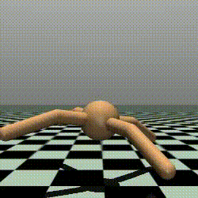
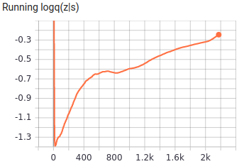
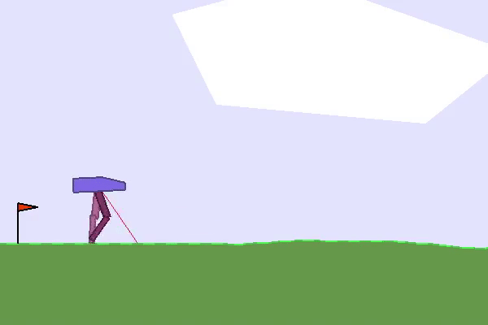
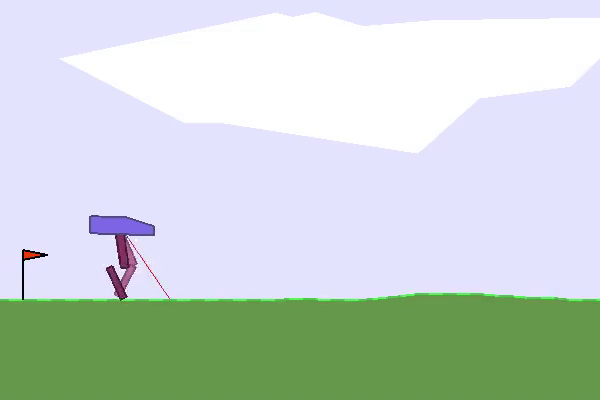
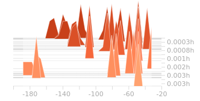
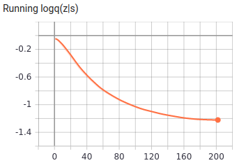
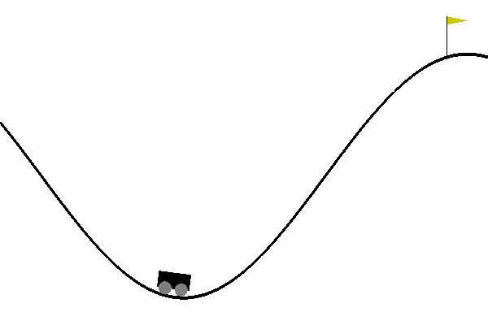
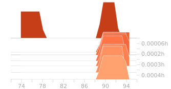
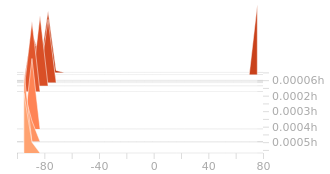

[](http://makeapullrequest.com)  
# DIAYN (Diversity is All You Need) – Updated Implementation

This repository contains an updated implementation of the DIAYN algorithm compatible with newer versions of MuJoCo and OpenAI Gym. It extends the original implementation by:

- Supporting additional environments such as `Humanoid`, `Reacher-v4`, etc.
- Fixing rendering and compatibility issues that occur in the original repository with newer Gym and MuJoCo versions. Alot of bugs got resolved here!!
- Maintaining the architecture and learning behavior as close as possible to the original paper and codebase.

📌 Original repo: [alirezakazemipour/DIAYN-PyTorch](https://github.com/alirezakazemipour/DIAYN-PyTorch)

This version is intended for easier use, reproduction, and experimentation with DIAYN in modern setups.

# DIAYN:
While intelligent  creatures can explore their environments and learn useful skills without supervision, many RL algorithms are heavily on the basis that acquiring skills is only achieved via defining them as explicit reward functions to learn.
    
Thus, in order to translate the natural behavior of creatures in learning **diverse** skills to a suitable mathematical formulation, DIAYN (Diversity is All You Need) was proposed for learning useful skills **without any domain-specific reward function**.
    
Instead of the real reward of the environment, DIAYN optimizes the following objective:

<p align="center">
  
</p>

that _`z`_ is the skill that the agent is learning and, since we desire learned skills to be **as diverse as possible**, _`z`_ is modeled by a Uniform random variable that has the highest standard variation.
    
The above equation simply implies that the reward of any diverse task is equal to measuring how hard recognizing the skill _`z`_ is, given the state _`s`_ that the agent has visited compared to the real distribution over _`z`_ (which is Uniform distribution in DIAYN paper.)   
The bigger r<sub>z</sub>(s, a) is, the more ambiguous skill _`z`_ is thus, the state _`s`_ should be visited more for task _`z`_ so, the agent finally acquires this skill.

Concurrently to learn r<sub>z</sub>(s, a), any conventional RL method can be utilized to learn a policy and DIAYN uses SAC.

**This repository is a PyTorch implementation of Diversity is All You Need and the SAC part of the code is based on [this repo](https://github.com/alirezakazemipour/SAC).**

## Results
> x-axis in all of the corresponding plots in this section are counted by number episode.
### Reacher
>number of skills = 2 , Episodes = 5000

 Emergent behavior | Emergent behavior 
 :----------------: | :----------------: 
 | 

### Ant
>number of skills = 5 , Episodes = 500

 Behavior 1 | Behavior 2 | Behavior 3 | Behavior 4 | Behavior 5
 :----------------: | :----------------: | :----------------: | :----------------: | :----------------: 
 .gif)| .gif)| | | 

### Half-Cheetah
>number of skills = 5 , Episodes = 500

 Behavior 1 | Behavior 2 | Behavior 3 | Behavior 4 | Behavior 5
 :----------------: | :----------------: | :----------------: | :----------------: | :----------------: 
 .gif)| .gif)| .gif)| .gif)| .gif)

### Hopper
>number of skills = 20

<p align="center">
  
</p>

similar to the environment's goal| Emergent behavior| Emergent behavior
:-----------------------:|:-----------------------:|:-----------------------:
| | 
Reward distribution|Reward distribution|Reward distribution
| | 

### BipedalWalker
>number of skills = 50

<p align="center">
  
</p>

similar to the environment's goal| Emergent behavior| Emergent behavior
:-----------------------:|:-----------------------:|:-----------------------:
| | 
Reward distribution|Reward distribution|Reward distribution
| | 

### MountainCarContinuous
>number of skills = 20

<p align="center">
  
</p>

similar to the environment's goal| Emergent behavior| Emergent behavior
:-----------------------:|:-----------------------:|:-----------------------:
| | 
Reward distribution|Reward distribution|Reward distribution
| | 

## Installation
```bash
pip3 install -r requirements.txt
```
## Usage
### How to run
```bash
usage: main.py [-h] [--env_name ENV_NAME] [--interval INTERVAL] [--do_train]
               [--train_from_scratch] [--mem_size MEM_SIZE]
               [--n_skills N_SKILLS] [--reward_scale REWARD_SCALE]
               [--seed SEED]

Variable parameters based on the configuration of the machine or user's choice

optional arguments:
  -h, --help            show this help message and exit
  --env_name ENV_NAME   Name of the environment.
  --interval INTERVAL   The interval specifies how often different parameters
                        should be saved and printed, counted by episodes.
  --do_train            The flag determines whether to train the agent or play
                        with it.
  --train_from_scratch  The flag determines whether to train from scratch or
                        continue previous tries.
  --mem_size MEM_SIZE   The memory size.
  --n_skills N_SKILLS   The number of skills to learn.
  --reward_scale REWARD_SCALE   The reward scaling factor introduced in SAC.
  --seed SEED           The randomness' seed for torch, numpy, random & gym[env].
```
- **In order to train the agent with default arguments , execute the following command and use `--do_train` flag, otherwise the agent would be tested** (You may change the memory capacity, the environment and number of skills to learn based on your desire.):
```shell
python3 main.py --mem_size=1000000 --env_name="Hopper-v4" --interval=100 --do_train --n_skills=20
```
- **If you want to keep training your previous run, execute the followoing:**
```shell
python3 main.py --mem_size=1000000 --env_name="Hopper-v4" --interval=100 --do_train --n_skills=20 --train_from_scratch
```
- **If you want to Test/ Evaluate the agent, execute the following:**
'''shell
python3 main.py --env_name="Hopper-v4" --n_skills=20
'''
### An important Note!!!
- **When I tried to keep training from checkpoints to continue my previous run, I observed some undesirable behavior from the discriminator that its loss rapidly converged towards 0 however, after some epochs it again returned to its correct previous training phase. I suspect since at the beginning of training from checkpoints the replay memory is empty and familiar experiences (according to the policy) gradually get added to it, the trained discriminator from the previous run can easily recognize their true skills until the replay memory gets populated big enough and contains newer and more novel transitions. Thus, I recommend running your whole training monotonically and avoid using checkpoints and successive pausing though, it is been provided.**

## Environments tested
- [x] Hopper-v4
- [x] bipedalWalker-v4
- [x] MountainCarContinuous-v0
- [x] Reacher-v4

```
1. _Brain_ dir consists of the neural network structure and the agent decision-making core.
2. _Common_ consists of minor codes that are common for most RL codes and do auxiliary tasks like logging and... .
3. _main.py_ is the core module of the code that manages all other parts and makes the agent interact with the environment.
```
## 🛠 Known Issues & Fixes

### 1. `iter` → `niter` Bug
- **Issue**: In newer versions of Python (3.9+), `iter` is a built-in function. Using it as a variable name caused conflicts or crashes with that of the gym files.
- **Fix**: Replaced instances of `iter` with `niter` in the codebase (e.g., training loops, argument parsing, etc.).

---

### 2. Rendering Issues on Windows (Mujoco + Gym)
- **Issue**: `render(mode='rgb_array')` returned `None` or raised errors on Windows systems, particularly in virtualized or headless environments.
- **Fix**: 
  - Passed correct `render_mode` when calling `gym.make()`:
    ```python
    env = gym.make("Reacher-v4", render_mode="rgb_array")
    ```
  - Added a minimal `testmujoco.py` script to debug rendering independently.

---

### 3. Compatibility with Modern Gym/Mujoco Envs
- **Issue**: The original repository used deprecated versions of `mujoco-py` and `gym`.
- **Fix**:
  - Migrated the codebase to support `gym>=0.26`, `mujoco>=2.3`, and new-style API (`gymnasium`-compatible).
  - Integrated support for additional environments such as `Reacher-v4`, `Humanoid-v4`, and others.

---

### 4. Video File Corruption (`cv2.VideoWriter`)
- **Issue**: Rendered videos for skills were unplayable (`.avi` files could not be opened).
- **Fix**:
  - Ensured `frame is not None` before writing to video.
  - Handled OpenCV codec and frame shape compatibility explicitly.
  - Skipped writing and logged warnings when rendering failed to avoid silent corruption.

---

### 5. Environment Reinitialization API Change
- **Issue**: Calling `reset()` without unpacking the returned tuple caused errors due to API changes in newer Gym versions.
- **Fix**:
  - Updated code to use the modern unpacking format:
    ```python
    obs, _ = env.reset()
    ```

---
- **These were only few of the changes listed here, this is in no way a comprehensive and detailed list of all the changes I've made in the repo to transition the codebase to the latest software versions. Please feel free to reachout for any issues/bugs, would love to look into those!**

## Reference

1. [_Diversity is All You Need: Learning Skills without a Reward Function_, Eysenbach, 2018](https://arxiv.org/abs/1802.06070)

